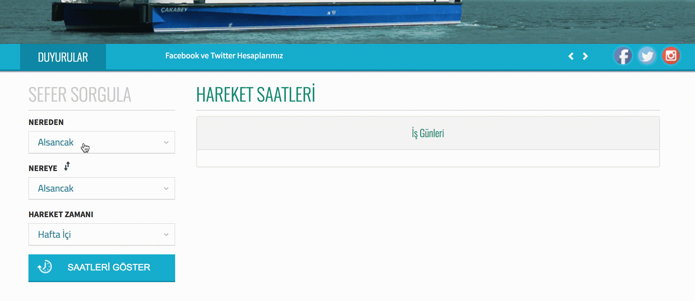

= Swapur

---

Siz de benim gibi arada istasyon noktalarını değiştirmekte zorlanıyorsanız, bu eklenti tam size göre :)

== Kullanım

=== 1. yol

1. Chrome Web Store üzerinden Swapur eklentisini https://chrome.google.com/webstore/detail/swapur/ffokknpomoejhlolbchcomghhgimijhh[indirin].
2. http://www.izdeniz.com.tr/tr/anasayfa üzerinden yapılacak ilk sorgulamdan sonra açılan sayfa üzerinden swapur hizmetinizdedir! Danss...

=== 2. yol

1. Bu eklentiyi sisteminize https://github.com/ozlerhakan/swapur/archive/master.zip[indirin].
2. Zip içerisinden projenin aslını çıkartın.
3. Chrome üzerinden `more tools > extentions > Load unpacked extension..` butonuna tıklayın ve swapur dizinini seçip onaylayın.
3. http://www.izdeniz.com.tr/tr/anasayfa üzerinden yapılacak ilk sorgulamdan sonra açılan sayfa üzerinden swapur hizmetinizdedir! Danss...

---

1. ve 2. adımlara alternatif olarak:

[source, bash]
----
$ git clone https://github.com/ozlerhakan/swapur.git
$ ls
swapur
----
